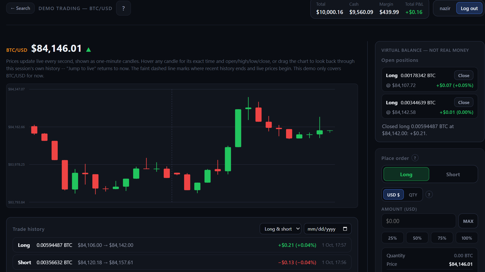
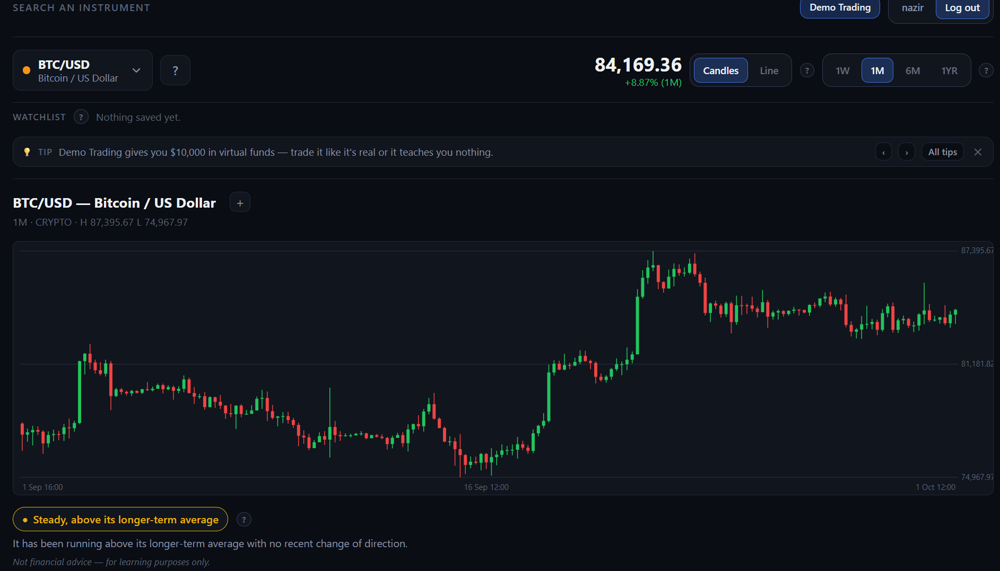
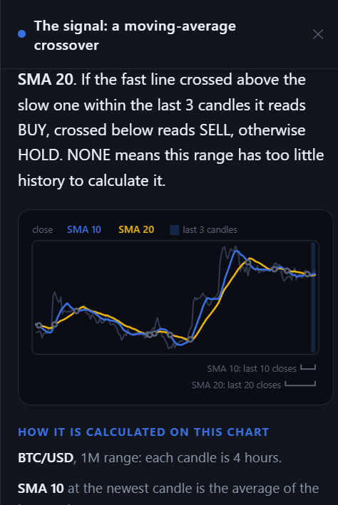
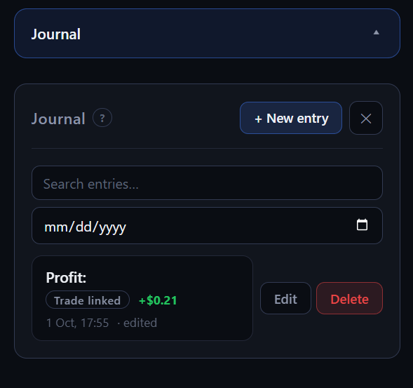
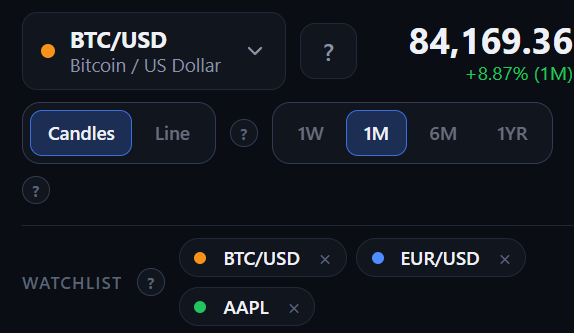
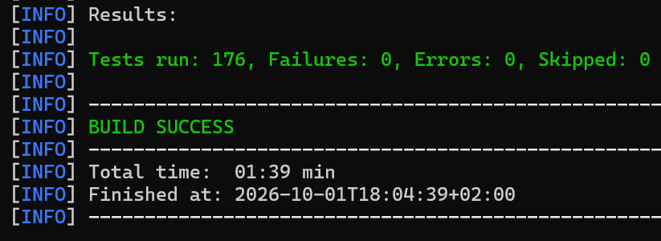
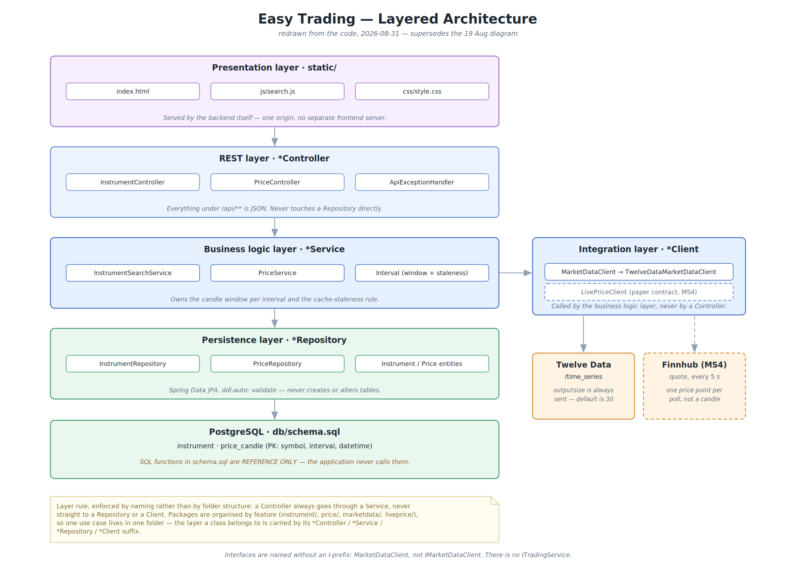

# Easy Trading

[](https://github.com/Nazirp/Easy-trading/actions/workflows/ci.yml)

**A trading app for complete beginners.** It shows live crypto, forex and stock
charts and explains them in plain language. You can practise long and short
trades with virtual money, and a trading journal tells you whether your
reasoning was right.

Built by a team of three for the *Informatik 3* course at HTW Berlin.
Java 21 · Spring Boot 3 · PostgreSQL 16 · WebSocket · Docker · plain HTML/CSS/JavaScript.

> Not financial advice. Easy Trading uses virtual money only and is for learning purposes.



## Features

- **Charts with a plain-language signal.** Search an instrument and see its
  candlestick or line chart over 1W, 1M, 6M or 1YR. A signal badge calculated
  from a moving-average crossover (SMA 10 against SMA 20) is phrased as a
  sentence, for example "Steady, above its longer-term average", rather than
  shown as a raw indicator value.
- **Explanations where you need them.** Every "?" opens a side panel. The
  signal explainer draws both moving averages on the chart you are looking at
  and works out the calculation step by step. Click any candle to see its
  open, high, low and close.
- **Demo trading on a live price feed.** Start with $10,000 of virtual money,
  open a long or short position on BTC/USD and watch its profit and loss move
  every second. The server builds one-minute candles from Finnhub's live trade
  stream, about 20 trades a second.
- **A trading journal.** Write down why you took a trade and link the entry to
  the trade. The entry then shows the trade's result. Filter your entries by
  winning or losing trades.
- **Accounts and a watchlist.** Sign up, log in, and keep your favourite
  instruments one click away.

| Chart and signal | Signal explainer |
|---|---|
|  |  |

| Trading journal | Watchlist |
|---|---|
|  |  |

## Running it

### What you need

- **Docker Desktop**, installed and running.
- **Two free API keys.** Both take a minute to get:

  | Key | Get it at | Used for | Without it |
  |---|---|---|---|
  | `TWELVEDATA_API_KEY` | [twelvedata.com](https://twelvedata.com/) | every historical chart, and the history part of the live chart | charts don't load, and the instrument list shows no prices |
  | `FINNHUB_API_KEY` | [finnhub.io](https://finnhub.io/) | the live price in demo trading | there is no live price, so trades are refused |

- **Java 21 and Maven 3.9**, only if you want to run the backend outside Docker
  (option B) or run the tests.

### Option A: Docker Compose (recommended)

1. Copy the example environment file and fill in your two keys:

   ```bash
   cp .env.example .env        # Windows: copy .env.example .env
   ```

   `.env` is git-ignored, so your keys never get committed.

2. Start the database and the app:

   ```bash
   docker compose up --build
   ```

3. Open <http://localhost:8080>, sign up, and try it.

`Ctrl+C` stops the app. `docker compose down` removes the containers but keeps
your accounts and trades. `docker compose down -v` also deletes the database.

If you change frontend files, start again with `docker compose up --build`, so
the new files are built into the image.

### Option B: run the backend from your IDE or Maven

Use this to set breakpoints or get hot reload while developing.

1. Start only the database. The schema and the instrument list are loaded
   automatically:

   ```bash
   docker compose up -d db
   ```

2. Set the two keys in the same terminal. Spring Boot does not read `.env`:

   ```bash
   # macOS / Linux
   export TWELVEDATA_API_KEY=your-key FINNHUB_API_KEY=your-key
   ```

   ```powershell
   # Windows PowerShell
   $env:TWELVEDATA_API_KEY="your-key"; $env:FINNHUB_API_KEY="your-key"
   ```

3. Run the backend and open <http://localhost:8080>:

   ```bash
   cd backend
   mvn spring-boot:run
   ```

The database listens on port **5433** rather than the default 5432, so it does
not clash with a Postgres already installed on your machine.

## Tests

```bash
cd backend
mvn test
```

**176 tests.** You need Docker running, but no API keys. The suite has two
kinds of tests:

- **Unit tests** cover the logic with no Spring, database or network: profit
  and loss for long and short trades, the moving-average signal, building
  candles from trades, the Finnhub message parser, and the trading and journal
  rules.
- **Integration tests** start the real application against a real PostgreSQL
  in Docker ([Testcontainers](https://testcontainers.com/)) and call it over
  HTTP. Twelve Data and Finnhub are replaced by
  [WireMock](https://wiremock.org/) stubs. They check what only a real database
  can show, such as two simultaneous "Close" clicks on one trade crediting the
  account exactly once.

GitHub Actions runs the whole suite on every push.



## How it is built



- **Four layers.** Requests go controller → service → repository or API
  client. A controller never touches the database directly.
- **Packages by feature** (`price`, `liveprice`, `trading`, `journal`, `watchlist`,
  `user`, …). Each feature folder holds its own controller, service and
  repository.
- **External APIs sit behind our own interfaces** (`MarketDataClient`,
  `LivePriceClient`). Only one class knows what each provider's responses look
  like, and tests can swap in a fake.
- **The server owns every number that matters.** The server sets the trade
  price; a price sent by the browser is ignored. Money is stored as exact
  decimals, never floating point. A trade can be closed only once, and the
  database itself enforces that.

More detail:

- [`backend/CONTRACTS.md`](backend/CONTRACTS.md): every REST endpoint, its
  request and response shapes, and its error codes.
- [`docs/diagrams/`](docs/diagrams/): the use case, layered, component and
  sequence diagrams, generated from a script.
- [`docs/DECISIONS.md`](docs/DECISIONS.md): the most important design
  decisions, and what we learned from the mistakes.

### Project layout

| Path | What it is |
|---|---|
| `backend/src/main/java/` | Spring Boot: REST endpoints, business logic, API clients, persistence |
| `backend/src/main/resources/static/` | The frontend (HTML, CSS, JavaScript), served by the backend |
| `backend/src/test/java/` | Unit and integration tests |
| `db/schema.sql` | The database schema, the single source of truth for tables |
| `db/seed.sql` | The instrument list. Candles are not seeded; they come from Twelve Data |
| `docs/` | Diagrams, screenshots and design decisions |

## Team

| | Main responsibility |
|---|---|
| **Mohammad Nazir Pashtoonyar** | Project management: Scrum backlog, user stories and sprint planning in Jira. Backend: REST API, Twelve Data and Finnhub integration, live trade stream and candle building, trading model, authentication, test suite, architecture and API documentation |
| **Isna Ghifari** | Frontend: pages, charts and user interface |
| **Glenn Angelo Tantra** | Database: schema, constraints and persistence |

We worked in Scrum sprints, with requirements written as personas and fully
specified use cases.

## Notes for contributors

- **Never commit API keys.** `application.yml` reads them from environment
  variables; keep it that way.
- **Hibernate runs with `ddl-auto: validate`.** It never creates or changes
  tables. If you change a column in `db/schema.sql`, update the entity too, or
  the app won't start. Run `docker compose down -v` to apply a changed schema.
- See [`CONTRIBUTING.md`](CONTRIBUTING.md) for branches and commit messages.
